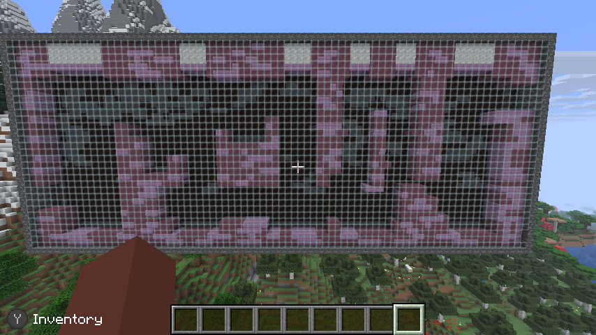
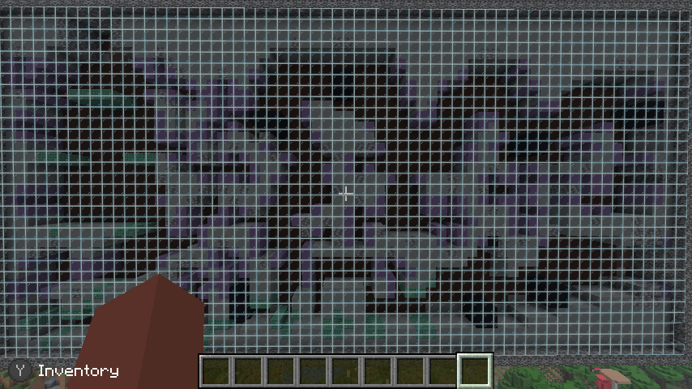
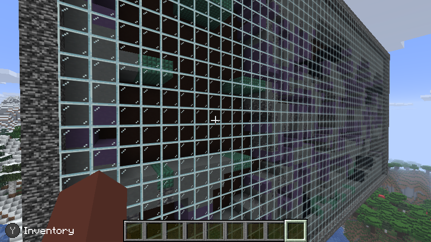
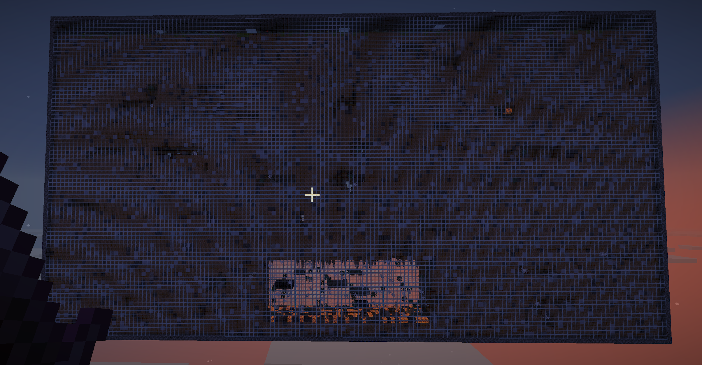
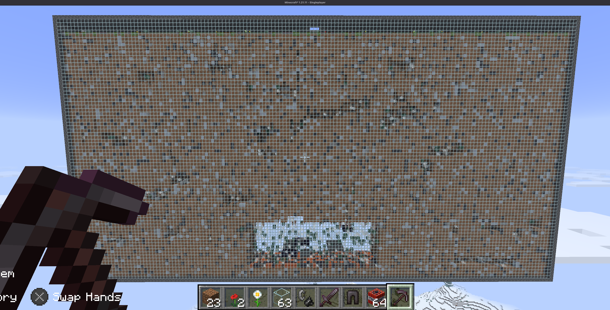
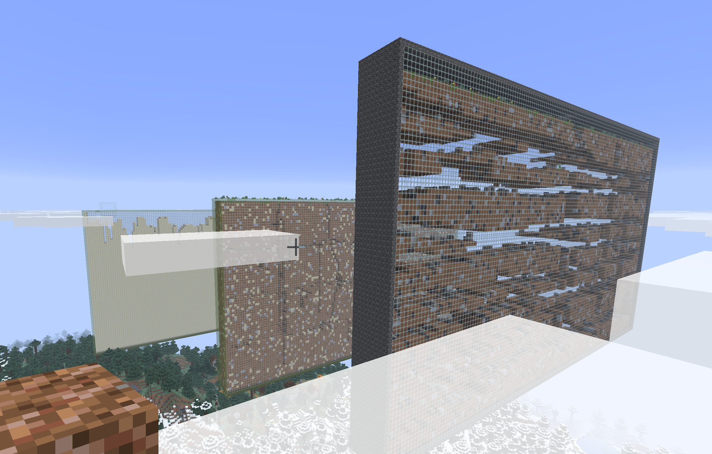
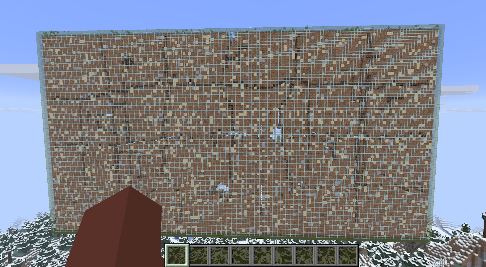
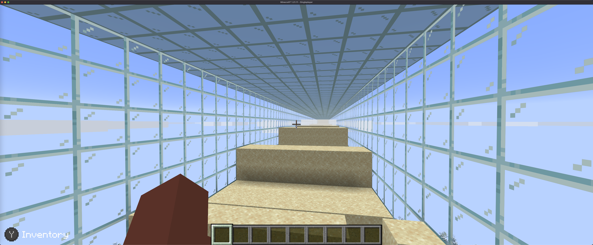
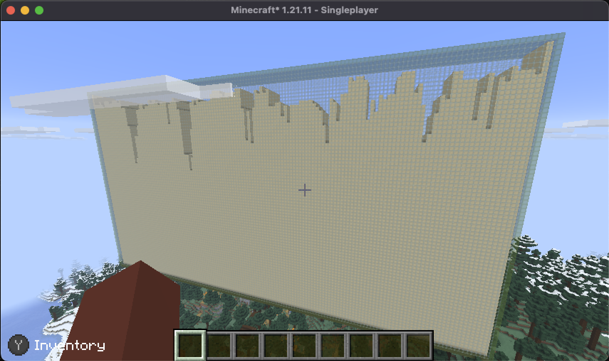

# 🐜 Minecraft Mods Collection

A collection of custom Minecraft Fabric mods for unique gameplay experiences.

## Mods Included

### Super Metroid Room Generator

Renders Super Metroid rooms as playable Minecraft structures. Each room is built from the original game's tile data — solid tiles become collidable blocks behind a glass viewing wall, with color-matched materials for each area's palette.

#### Commands
```
/sm create <room>    # Generate a room (e.g., /sm create crab_maze)
/sm rooms            # List available rooms
```

The same mod jar also includes the 3D maze generator:

```text
/maze3d <width> <height> <depth>
/maze3d <width> <height> <depth> <wall_block> [seed]
/maze3d status
```

For example, `/maze3d 5 3 5 obsidian 12345` creates a reproducible 5x3x5-cell maze. Commands require cheats/operator permissions.

The three dimensions are logical maze cells in `width height depth` order, not final block dimensions. With the default corridor spacing, `W H D` renders as `(2W+1) × (3H) × (2D+1)` blocks. The entrance is placed at the player's current Y and additional levels build downward, so a 100x125x125-cell maze is 201x375x251 blocks and descends 373 blocks below the entrance. There is no separate two-million-cell command cap; generation is limited only when the expanded render would exceed the in-memory renderer's safety ceiling or Minecraft's coordinate limits.

#### Available Rooms
- `east_cactus_alley_room` — Purple Brinstar
- `crab_maze` — Green Brinstar

#### Screenshots







---

### 🐜 AntFarm Battle Royale Generator

Procedurally generates giant AntFarm for battle royale with other players.

The Antfarm includes: 

- **Maze-like tunnel networks** - Winding passages, hidden alcoves, dead ends
- **Depth-based difficulty** - Easier at top, harder (and better loot!) at bottom
- **Queen's Chamber** - A hellish boss arena at the bottom with spikes, platforms, and treasure
- **Loot chests** - Scattered throughout with depth-scaled rewards
- **Monsters** - Cave spiders, regular spiders, and skeletons lurking in the tunnels
- **Light shafts** - Narrow tunnels to the glass walls for natural lighting
- **Unbreakable walls** - Bedrock frame with barrier-protected glass viewing panels

#### Commands
```
/antfarm demo              # Creates a 30x20x5 demo ant farm
/antfarm create <W> <H> <D> # Custom size (e.g., /antfarm create 100 60 8)
```

## Screenshots














## Requirements

- A Minecraft version matching the mod's build configuration (`super_metroid` currently builds against 26.1.2; `antfarm` targets 1.21.x)
- Fabric Loader 0.16+
- Fabric API
- Fabric Language Kotlin

## Installation

1. Install Fabric Loader for Minecraft 1.21.x
2. Copy mod jars and `fabric-language-kotlin.jar` to your mods folder
3. Launch Minecraft with the Fabric profile

### Modrinth App profile

Modrinth profiles use their own `mods/` folders. Installing a jar in this repository's top-level `mods/` folder only installs it for the local Fabric server; it does not install it in Modrinth or in an individual world save.

The current development profile is:

```text
/Users/kenny/Library/Application Support/ModrinthApp/profiles/Ken_s Dev Land/
```

To rebuild and install the Super Metroid/Maze3D mod in that profile:

```bash
cd /Users/kenny/Kentroid/Minecraft/mods/super_metroid
./gradlew build
cp build/libs/super-metroid-mod-1.0.0.jar \
  "/Users/kenny/Library/Application Support/ModrinthApp/profiles/Ken_s Dev Land/mods/"
```

The profile must also have compatible versions of Fabric API and Fabric Language Kotlin. Install both from the Modrinth app's **Content** page. Maze3D is included in `super-metroid-mod-1.0.0.jar`; there is no separate Maze3D jar.

The `Ken_s Dev Land` profile currently runs Minecraft 26.2, while the mod's Gradle build targets 26.1.2. Its manifest permits loading on newer Minecraft versions, but smoke-test it after Minecraft updates and update the versions in `mods/super_metroid/build.gradle` if Minecraft reports an incompatibility.

Fully quit Minecraft before replacing a jar, then relaunch the `Ken_s Dev Land` profile. Custom command mods do not necessarily appear in Minecraft's menus; verify this one with `/maze3d 5 3 5` in a cheats-enabled world and check `logs/latest.log` for `Super Metroid Rooms loaded!` if needed.

## Building from Source

```bash
cd mods/antfarm
./gradlew build
```

The compiled jar will be in `build/libs/`.

## Server Setup

```bash
# Set Java 21+ via jenv
jenv local 23

# Start the Fabric server (allocates 2GB RAM)
java -Xmx2G -jar fabric-server-launch.jar nogui
```

## License

MIT
